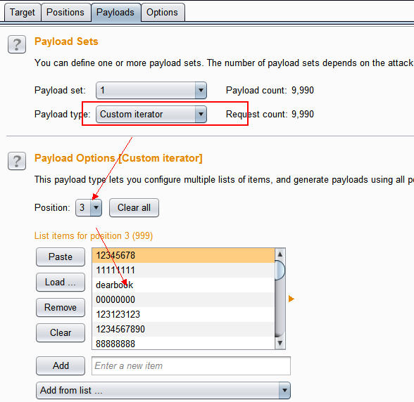

### reCAPTCHA

一个burp插件，自动识别图形验证码，并用于Intruder中的Payload。

### 使用

安装：

1. 从[这里](https://github.com/bit4woo/reCAPTCHA/releases)下载插件。
2. 将它添加到burp。如果没有遇到错误，你将看到一个新的名为“reCAPTCHA”的tab。

准备：

1. 通过burp代理访问目标网站（或APP）。
2. 在proxy中找到获取图形验证码的请求，选中它并点击右键选择“Send to reCAPTCHA”。
3. 切换到reCAPTCHA标签，并配置所需的参数。（http://www.ysdm.net API是目前唯一支持的接口），当参数配置好后，你可以点击“请求”按钮来测试配置。
4. 完成了配置并测试成功后，现在可以在Intruder中使用该插件生成的payload了。

在Intruder中使用：

有2种情况：用户名或密码之一+验证码；用户名+密码+验证码；

情况一：只有密码或只有用户名需要改变，我们可以用Pitchfork 模式来配置。运行效果如下：

情况二：用户名和口令都需要改变，这是稍微负责点。我们还是使用Pichfork模式，但需要将用户名和密码一起标注为一个插入点。像这样:

然后对对一个插入点，做如下配置，使用“自定义迭代器（Custom interator）”。并在迭代器中组合用户名和密码。

运行效果如图：

### reCAPTCHA界面截图

### 

日志

2017-11-01：第一个demo版本发布。