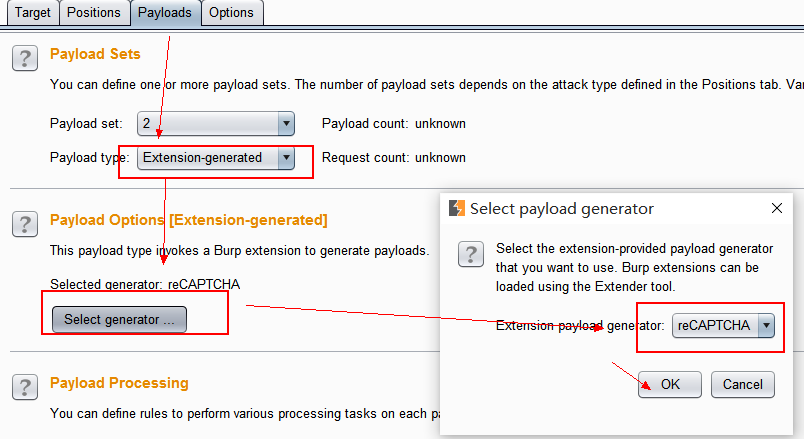
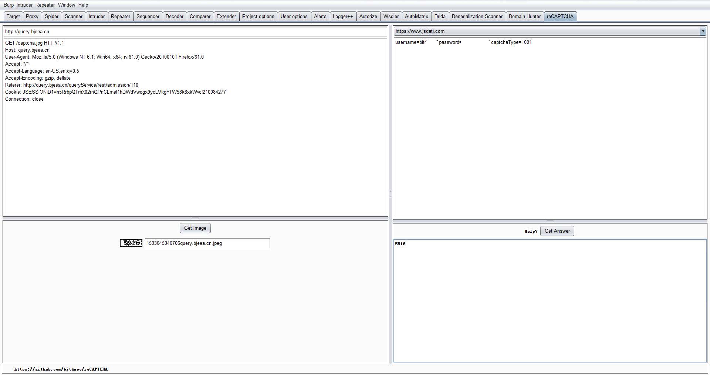

### reCAPTCHA

一个burp插件，自动识别图形验证码，并用于Intruder中的Payload。

### 使用

安装：

1. 从[这里](https://github.com/bit4woo/reCAPTCHA/releases)下载插件。
2. 将它添加到burp。如果没有遇到错误，你将看到一个新的名为“reCAPTCHA”的tab。

准备：

1. 通过burp代理访问目标网站的登录界面。

2. 在proxy中找到获取图形验证码的请求，选中它并点击右键选择“Send to reCAPTCHA”，这个请求的信息将被发送到reCAPTCHA。

   

3. 切换到reCAPTCHA标签，并配置所需的参数。当参数配置好后，你可以点击“请求”按钮来测试配置。

4. http://www.ysdm.net 的API是目前唯一支持的接口,其中的各项参数需要自行注册帐号并填写，才能成功调用接口完成图片的识别。该API需要的参数如下，请用正确的值替换%s ，特别注意typeid值的设定(http://www.ysdm.net/home/PriceType)。

   `username=%s&password=%s&typeid=%s&timeout=%s&softid=%s&softkey=%s`

在Intruder中使用：

完成了配置并测试成功后，现在可以在Intruder中使用该插件生成的payload了。有2种情况：用户名或密码之一+验证码；用户名+密码+验证码；

 

**情况一**：只有密码或只有用户名需要改变，我们可以用Pitchfork 模式来配置。

比如，已知系统存在一个用户admin，来爆破该用户，插入点标记如下，

payload 1我们从文件中加载，这个不必多说。

payload 2 选择“Extension-Generated”.

运行效果如下：

 

**情况二**：用户名和口令都需要改变，这个稍微复杂点。我们还是使用Pichfork模式，但需要将用户名和密码一起标注为一个插入点。像这样:

payload 1 使用“自定义迭代器（Custom interator）”。并在迭代器中组合用户名和密码。

在该例子中，即 position 1为用户名，position 2 为“&j_password=”，postion 3为密码。

payload 2 的配置和情况一中的配置完全一样。

运行效果如图：

### reCAPTCHA界面截图

### 

### 日志

2017-11-01：第一个demo版本发布。

**作者**

[bit4](http://www.code2sec.com/)@[勾陈安全](http://www.polaris-lab.com/)